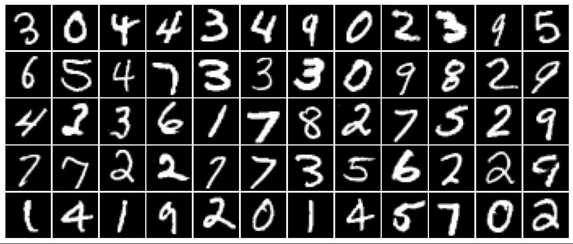
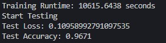

# Convolutional Neural Network (CNN) from Scratch
This project implements a Convolutional Neural Network (CNN) from scratch using Python and NumPy, without relying on deep learning frameworks like TensorFlow or PyTorch. The primary goal of this project is to gain a deeper understanding of how CNNs work, including operations like convolution, pooling, activation functions, and backpropagation.

## Features
* Custotm CNN implementattion: Core functionalities such as convolution, max pooling, and fully connectetd layers are implementetd from scratch.
* MNIST datasett: The model is trained and tetsted on the MNIST dataset of handwritten digits.
* Educational focus: The project is structured to help other learn about CNN fundamentals.

## Dataset
The MNIST dataset is used in this project. It can be download here: [MNIST dataset](https://yann.lecun.com/exdb/mnist/)

## Architecture
* Convolution Layer (8 x 3 x 3)
* Maxpool Layer (2 x 2)
* Softmax

## Highlights of the implemantation
* Forward Pass: Implements convolutional and pooling layers.
* Backpropagation: Gradientt computation for convolutional and fully connectetd layers.
* Optimizatiton: Uses Stochastic Gradient Descent (SGD) for parameter updates.

## Results
* Training phase took 2.95 hours. 
* Achieved ~96% accuracy on the MNIST test dataset.

## Future Enhancements
* Add ReLU (Rectified Linear Unit) activation layer.
* Implement additional features like fropout and batch normalization.
* Extetnd dataset like CIFAR-10 or custom datasets.

